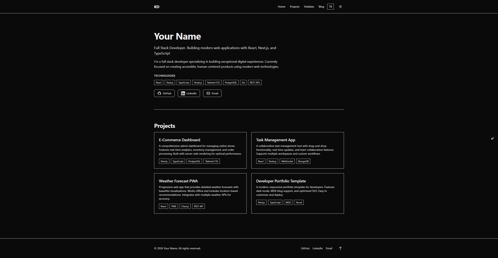
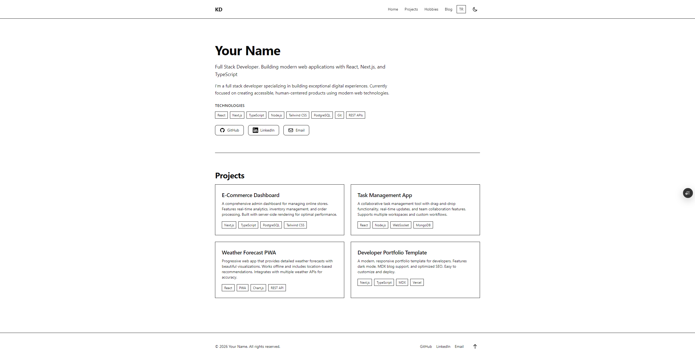
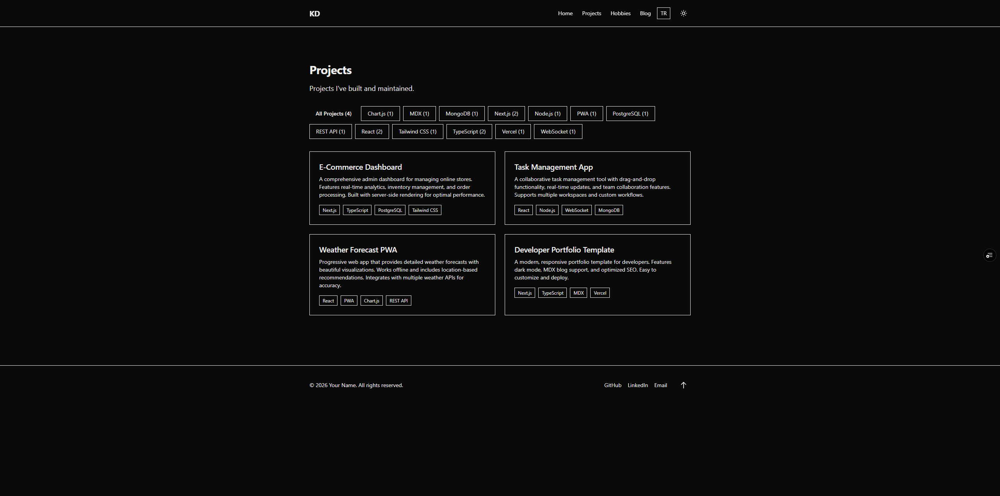
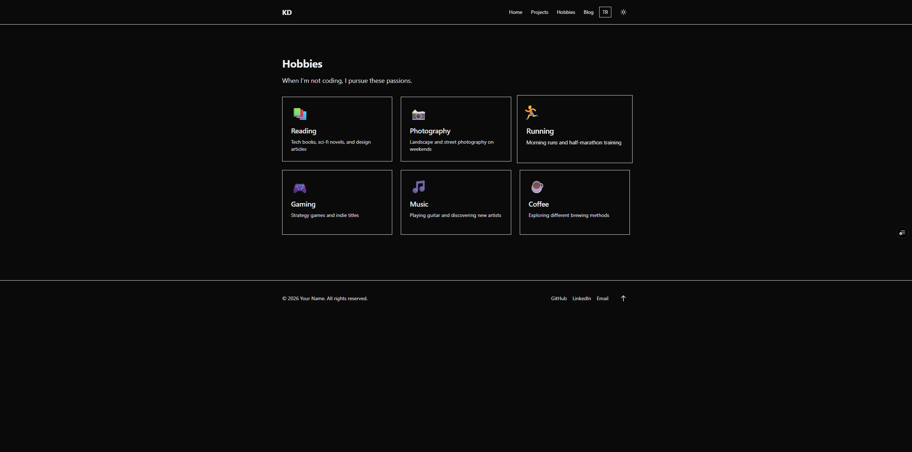
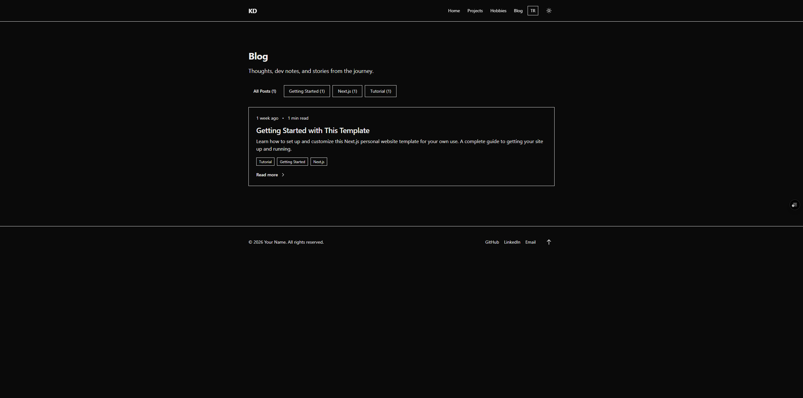

# Next.js Personal Website Template

A clean, modern template for developers to showcase their work, share blog posts, and build their online presence. Built with Next.js 16, React 19, and TypeScript.

[](LICENSE)
[](https://nextjs.org/)
[](https://www.typescriptlang.org/)

**[Live Demo](https://nextjs-personal-site-template.vercel.app)** • **[Türkçe](./README.tr.md)** • **[Documentation](./SETUP.md)** • **[Report Bug](https://github.com/kursatdemirdelen/nextjs-personal-site-template/issues)**

## 🚀 One-Click Deploy

Deploy your own copy of this template with one click:

[](https://vercel.com/new/clone?repository-url=https://github.com/kursatdemirdelen/nextjs-personal-site-template&project-name=my-personal-site&repository-name=my-personal-site&env=NEXT_PUBLIC_SITE_URL&envDescription=Your%20site%20URL%20for%20SEO%20(sitemap,%20canonical%20URLs)&envLink=https://github.com/kursatdemirdelen/nextjs-personal-site-template%23environment-variables)
[](https://app.netlify.com/start/deploy?repository=https://github.com/kursatdemirdelen/nextjs-personal-site-template)

> After deployment, set `NEXT_PUBLIC_SITE_URL` to your domain in project settings.

## 📸 Screenshots

<p align="center">
  
  
</p>
<p align="center">
  
  
</p>
<p align="center">
  
</p>

---

## Features

- 📝 **MDX Blog** - Write posts in Markdown with React components
- 🎨 **Dark Mode** - Automatic theme switching with system preference detection
- 🌍 **i18n Support** - Turkish and English built-in, easy to add more
- 📊 **Project Showcase** - Display your work with tags and filtering
- 🎯 **SEO Optimized** - Auto-generated sitemap, RSS feed, and meta tags
- ⚡ **Fast Performance** - Server components and static generation
- 📱 **Fully Responsive** - Mobile-first design that works everywhere
- ♿ **Accessible** - ARIA labels, keyboard navigation, semantic HTML

## Quick Start

```bash
# Clone the template
git clone https://github.com/kursatdemirdelen/nextjs-personal-site-template.git my-website

# Install dependencies
cd my-website
npm install

# Start development server
npm run dev
```

Open [http://localhost:3000](http://localhost:3000) to see your site.

## Customization

### 1. Set Environment Variables

Copy `.env.example` to `.env.local` and update:

```bash
NEXT_PUBLIC_SITE_URL=https://your-domain.com
```

> **Vercel Users**: Set this in Project Settings → Environment Variables

### 2. Update Site Information

Edit `src/data/site.ts`:

```typescript
export const siteConfig = {
  name: "Your Name",
  title: "Your Professional Title",
  tagline: "Your tagline here",
  // URL is set via NEXT_PUBLIC_SITE_URL env variable
  socialLinks: { ... },
};
```

### 3. Add Your Projects

Edit `src/data/projects.ts`:

```typescript
export const projects: Project[] = [
  {
    title: "Project Name",
    description: "What it does and why it matters",
    url: "https://github.com/you/project",
    tags: ["React", "TypeScript"],
    slug: "project-name",
  },
];
```

### 4. Write Blog Posts

Create MDX files in `content/blog/`:

```mdx
---
title: "Post Title"
description: "Post description"
date: "December 22, 2025"
tags: ["Next.js", "React"]
---

Your content here...
```

See the [Setup Guide](./SETUP.md) for detailed instructions.

## Tech Stack

- **Framework**: [Next.js 16](https://nextjs.org/) with App Router
- **Language**: [TypeScript 5](https://www.typescriptlang.org/)
- **Styling**: [Tailwind CSS 4](https://tailwindcss.com/)
- **Content**: [MDX](https://mdxjs.com/)
- **i18n**: [next-intl](https://next-intl-docs.vercel.app/)
- **Theme**: [next-themes](https://github.com/pacocoursey/next-themes)

## Project Structure

```
src/
├── app/
│   ├── [locale]/           # Internationalized pages
│   │   ├── page.tsx       # Homepage
│   │   ├── blog/          # Blog pages
│   │   ├── projects/      # Project pages
│   │   └── hobbies/       # Hobbies page
│   └── api/               # API routes
├── components/
│   ├── layout/            # Header, Footer, etc.
│   ├── ui/                # Reusable components
│   └── blog/              # Blog-specific components
├── data/                  # Site content
│   ├── site.ts           # Main config
│   ├── projects.ts       # Your projects
│   └── hobbies.ts        # Your hobbies
└── i18n/                  # Internationalization

content/blog/              # MDX blog posts
messages/                  # Translation files
```

## Environment Variables

| Variable | Required | Description |
|----------|----------|-------------|
| `NEXT_PUBLIC_SITE_URL` | Yes | Your site URL (for SEO, sitemap, RSS) |

Create `.env.local` for local development:

```bash
cp .env.example .env.local
```

## Deployment

### Vercel (Recommended)

1. Push to GitHub
2. Import your repo on [vercel.com](https://vercel.com)
3. Add environment variable: `NEXT_PUBLIC_SITE_URL` = `https://your-domain.vercel.app`
4. Click Deploy

That's it! Vercel handles build, deployment, and automatic updates.

### Other Platforms

Works on any platform that supports Next.js:
- [Netlify](https://www.netlify.com/)
- [Cloudflare Pages](https://pages.cloudflare.com/)
- [Railway](https://railway.app/)

## Scripts

```bash
npm run dev          # Development server
npm run build        # Production build
npm run start        # Start production server
npm run lint         # Run ESLint
npm run type-check   # TypeScript validation
```

## Documentation

See **[SETUP.md](./SETUP.md)** for detailed configuration guide.

## Customization Examples

### Change Colors

Edit `src/app/globals.css`:

```css
:root {
  --accent: 0 84% 60%;  /* Your brand color */
}
```

### Add a Section

Create a new page in `src/app/[locale]/your-section/page.tsx`. Use existing pages as reference.

### Remove Features

Don't need hobbies? Delete the page and remove navigation links. Everything is modular.

## Contributing

Contributions welcome!

1. Fork the repo
2. Create a feature branch (`git checkout -b feature/amazing-feature`)
3. Commit your changes (`git commit -m 'Add amazing feature'`)
4. Push to the branch (`git push origin feature/amazing-feature`)
5. Open a Pull Request

## License

MIT License - see [LICENSE](./LICENSE) for details.

You're free to use this template for personal or commercial projects. Attribution appreciated but not required.

## Support

- 📧 **Issues**: [GitHub Issues](https://github.com/kursatdemirdelen/nextjs-personal-site-template/issues)
- 💬 **Discussions**: [GitHub Discussions](https://github.com/kursatdemirdelen/nextjs-personal-site-template/discussions)
- ⭐ **Star the repo** if you find it useful!

---

Built by [@kursatdemirdelen](https://github.com/kursatdemirdelen) • Star if you find it useful!
